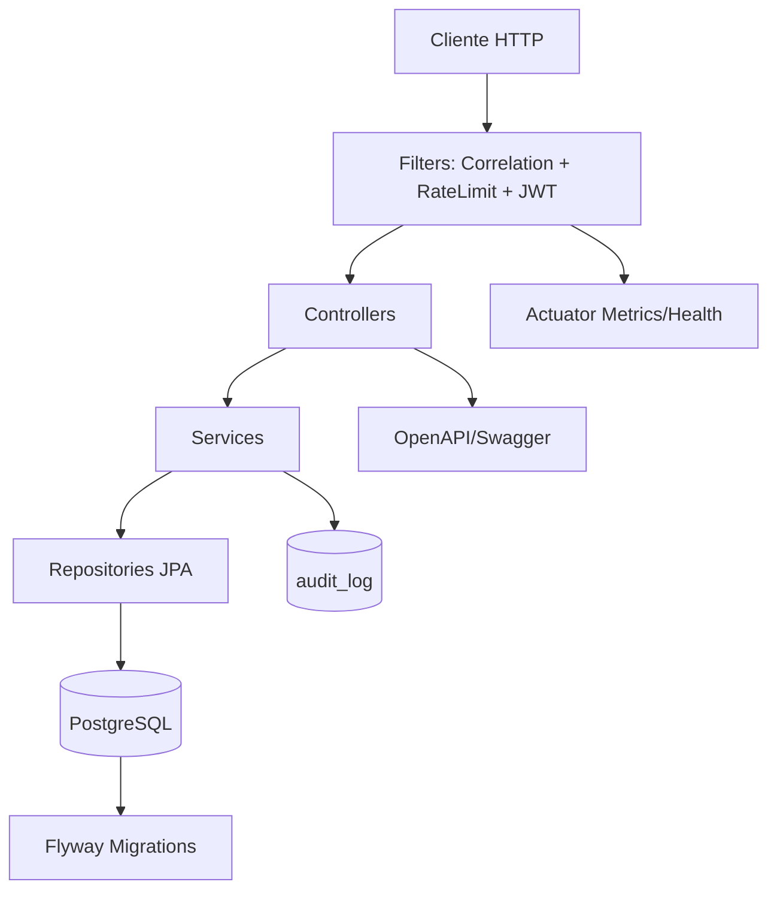

# Arquitectura

## Diagrama (Mermaid)

## Decisiones clave

- Arquitectura por capas (`controller -> service -> repository`) para velocidad de desarrollo y mantenibilidad.
- JWT stateless + refresh token persistido para sesiones renovables y logout real.
- Soft delete en `products` para trazabilidad y recuperacion.
- Auditoria de cambios sensibles en tabla `audit_log`.
- Problem Details (RFC7807) como contrato de error uniforme.
- Flyway para control de cambios de esquema en ambientes locales y cloud.
